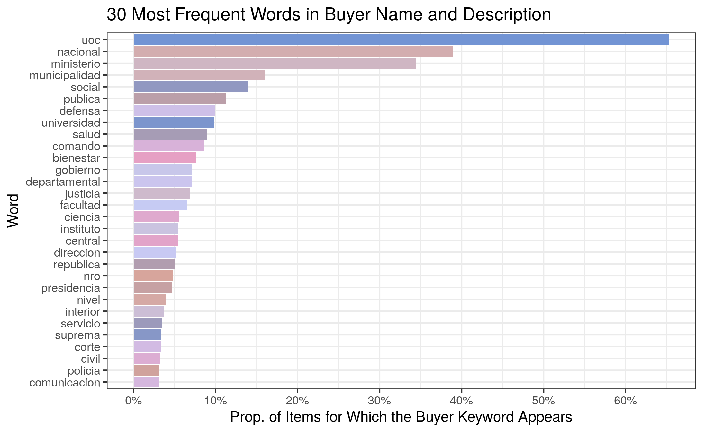

# Buyer Groupings {#buyer}

```{r buyer-setup, include=FALSE}
library(tidytext)
library(tidyverse)
library(tm)

theme_set(theme_bw())

knitr::opts_chunk$set(
  eval = FALSE,
  echo = FALSE,
  comment = NA,
  message = FALSE,
  warning = FALSE
)

setwd("..")
```

```{r buyer-data-import, include=FALSE}
dataset_names <- c("item_solicitado", "llamado_grupo", "llamado", "pac",
                   "unidad_contratacion", "entidad", "nivel_entidad")

datasets <- map(dataset_names, function(dataset_name) {
  file_name <- paste0("/files/data/", dataset_name, ".csv")
  file_name |>
    read_csv(na = c("", "NULL", "*"), col_types = cols(.default = "c")) |>
    type_convert()
})

names(datasets) <- dataset_names
```

```{r buyer-helper-functions, include=FALSE}
# function to clean a string
clean_string <- function(string) {
  string |>
    # remove all characters except letters
    str_replace_all(pattern = "[^[:alpha:] ]", replacement = " ") |>
    # make lowercase
    str_to_lower(locale = "es_PY") |>
    # remove non-ASCII characters (e.g. Spanish accents)
    iconv(to = "ASCII//TRANSLIT") |>
    # remove unnecessary whitespace
    str_squish()
}

# function to check whether a number is proper (i.e., not Inf, NaN, or NA)
is_proper_number <- function(number) {
  !is.infinite(number) & !is.na(number) & !is.nan(number)
}
```

## Buyer Information Fields {#buyer-information-fields}

Buyers will be considered at the tender level (i.e., one buyer for each row in the `llamado` table). The tables containing buyer/entity information are:

1. `unidad_contratacion`
             
    - left join onto pac by `pac.unidad_contratacion_id = unidad_contratacion.id`
    - **variable of interest:** `descripcion` (description of the buyer; probably easiest to do text mining on, since it includes exact institution names like "hospital" or "university")
    - **additional variables:** `tipo` (UOC, SUOC, or UEP) and `institucion` (whether the buyer is an institution or not)
    
2. `entidad`

    - left join onto `unidad_contratacion` by `unidad_contratacion.entidad_codigo_sicp = entidad.codigo_sicp`
    - **NOTE:** `entidad` has multiple rows  for each value of `entidad.codigo_sicp` (one per year), so the left join must be performed using a reduced version of `entidad` with a single row for each value (see the code snippet below for implementation)
     - **variable of interest:** `nombre` (name of the buyer at a higher level; does not include specific institution names, only broad government and municipality information)

3. `nivel_entidad`

    - left join onto `entidad` by `(entidad.anio, entidad.nivel_entidad_codigo) = (nivel_entidad.anio, nivel_entidad.nivel_entidad_codigo)`
    - **variable of interest:** `nombre` (very broad buyer levels within the public sector)
    
**CONCLUSIONS:** Combine `unidad_contratacion.nombre` and `entidad.nombre` into a single string to perform text mining on. Since `nivel_entidad.nombre` has relatively few categories with little text, it does not lend itself well to text mining. Instead, experiment with it as a categorical variable in its own right.

## Adding Buyer Information to Tenders {#buyer-add-info-to-tenders}

```{r buyer-data-joining, include=FALSE}
# find the buyer corresponding to each tender in llamado
llamado_with_buyers <- datasets$llamado |>
  # keep only joining columns from pac
  left_join(datasets$pac |>
              select(id, unidad_contratacion_id),
            by = c("pac_id" = "id")) |>
  # keep only joining columns and useful buyer info from unidad_contratacion
  left_join(datasets$unidad_contratacion |>
              select(id, tipo, institucion, entidad_codigo_sicp,
                     descripcion_entidad = descripcion),
            by = c("unidad_contratacion_id" = "id")) |>
  # entidad has multiple rows per codigo_sicp (one for each year)
  # keep only joining columns and useful buyer info from entidad
  left_join(datasets$entidad |>
              distinct(codigo_sicp, .keep_all = TRUE) |>
              select(codigo_sicp, nombre_entidad = nombre, nivel_entidad_codigo, anio),
            by = c("entidad_codigo_sicp" = "codigo_sicp")) |>
  # nivel_entidad has multiple rows per nivel_entidad_codigo (one for each year)
  # keep only joining columns and useful buyer info from nivel_entidad
  left_join(datasets$nivel_entidad |>
              select(nivel_entidad_codigo, anio, nivel_entidad = nombre),
            by = c("nivel_entidad_codigo", "anio")) |>
  # remove joining columns from final dataset
  select(-c(unidad_contratacion_id, entidad_codigo_sicp, nivel_entidad_codigo, anio))

# now join the buyer info onto each individual item
items <- datasets$item_solicitado |>
  left_join(datasets$llamado_grupo, by = c("llamado_grupo_id" = "id")) |>
  left_join(llamado_with_buyers, by = c("llamado_id" = "id"))
```

**ISSUE:** The buyer joining process must somehow be incorporated into the feature engineering script, but relational column inconsistencies (in terms of naming and number) and the bidirectional joining order would significantly increase the complexity of the config file.

**IMPLEMENTED SOLUTION:** Perform the buyer joining process in a separate script, which then gets sourced within the feature engineering script if buyer-related variables are listed as predictors in the config file.

## Buyer Levels {#buyer-level}

We fit an OLS regression model for `log_precio_unitario` (our target) against `nivel_entidad` to see how much variability this predictor accounts for by itself.

```{r buyer-nivel-entidad-model}
# prepare dataset for regression
items_clean <- items |>
  mutate(log_precio_unitario = log(precio_unitario)) |>
  filter(is_proper_number(log_precio_unitario)) |>
  # clean up nivel_entidad variable to have uniformly-named categories across years
  mutate(nivel_entidad = clean_string(nivel_entidad))

nivel_entidad_model <- lm(log_precio_unitario ~ nivel_entidad, data = items_clean)

saveRDS(nivel_entidad_model, file = "resources/buyer/nivel-entidad-model.rds")
```

```{r, eval=TRUE}
nivel_entidad_model <- readRDS("resources/buyer/nivel-entidad-model.rds")

jtools::summ(nivel_entidad_model, digits = 4, model.info = FALSE)
```

By itself, `nivel_entidad` accounts for a statistically significant 1.5\% of the variability in `log_precio_unitario`, so we might consider including it in our model. But what about in conjunction with other predictors?

**ISSUE:** The `nivel_entidad` variable has 15 categories; we must find the best way to merge them.

## Buyer Names and Descriptions {#buyer-name-description}

We join the name and description of a buyer into a single string for each tender and perform text mining.

```{r buyer-data-wrangling, include=FALSE}
digits <- c("dos", "tres", "cuatro", "cinco", "seis", "siete", "ocho", "nueve", "diez")

# exclude toponyms (extraneous information)
toponyms <- datasets$entidad |>
  mutate(nombre = nombre |>
           str_to_lower(locale = "es_PY") |>
           iconv(to = "ASCII//TRANSLIT")) |>
  filter(str_detect(nombre, "municipalidad de")) |>
  mutate(nombre = str_replace_all(nombre, "municipalidad de", "")) |>
  tidytext::unnest_tokens(output = municipalidad, input = nombre) |>
  pull(municipalidad) |>
  unique()

stopwords <- tibble(word = c(tm::stopwords("spanish"), digits, toponyms))

buyer_keywords <- items |>
  # merge the name and description fields into one, and clean the resulting string
  mutate(buyer = clean_string(paste(nombre_entidad, descripcion_entidad))) |>
  # keep track of each buyer using the item_solicitado id
  select(id, buyer) |>
  # unnest buyer descriptions into one-row-per-word to remove stopwords
  tidytext::unnest_tokens(output = word, input = buyer) |>
  anti_join(stopwords, by = "word") |>
  # turn plurals into singulars
  mutate(word = str_replace_all(word, pattern = "es$|s$", replacement = "")) |>
  # remove short words and strings containing "paraguay"
  filter(nchar(word) > 2, !str_detect(word, "paraguay")) |>
  # remove duplicate words from the same description
  distinct() |>
  # regroup words into original buyer descriptions
  group_by(id) |>
  summarize(buyer = paste(word, collapse = " "))
```

## Most Frequent Words {#buyer-frequent-words}

Below are the 30 most frequent words in the buyer descriptions, along with the proportion of items for which that buyer keyword appears:

```{r buyer-frequent-words}
word_freq <- buyer_keywords |>
  tidytext::unnest_tokens(output = word, input = buyer) |>
  count(word, sort = TRUE) |>
  mutate(prop = round(n / nrow(items), 4))

word_freq |>
  top_n(30, wt = prop) |>
  ggplot(aes(x = prop, y = reorder(word, prop), fill = word)) +
  geom_bar(stat = "identity") +
  scale_x_continuous(breaks = seq(0, 0.6, by = 0.1),
                     labels = scales::label_percent(accuracy = 1)) +
  scale_fill_manual(values = wesanderson::wes_palette("GrandBudapest2", n = 30,
                                                   type = "continuous")) +
  labs(title = "30 Most Frequent Words in Buyer Name and Description",
       x = "Prop. of Items for Which the Buyer Keyword Appears", y = "Word") +
  theme(legend.position = "none")

ggsave("resources/buyer/frequent-words.png")
```



## Final Buyer Groupings {#buyer-groupings}

Since there may be overlap between the keywords present in each buyer name and description, we will be treating the buyer groupings as indicator variables (to which a buyer either belongs or not) -- mutually exclusive categories would not make sense here. Some potential indicator variable groupings are:

- Police: `"policia"`
- Hospital: `"hospital"` or `"cancer"`
- Science: `"ciencia"`
- Health: `"salud"`
- Law: `"justicia"` or `"judicial"`
- Ministry: `"ministerio"`
- Education: `"universidad"`, `"facultad"`, or `"educacion"`
- Army: `"defensa"`, `"comando"`, `"armada"`, or `"ejercito"`
- Bank: `"banco"`
- Tech: `"tecnologia"` or `"aeronautica"`
- Electricity: `"ande"` (administracion nacional de electricidad) or `"electricidad"`

```{r buyer-grouping-patterns}
# potential indicator variables for clustering buyers
patterns <- c(
  police = "policia",
  hospital = "hospital|cancer",
  science = "ciencia",
  health = "salud",
  law = "justicia|judicial",
  ministry = "ministerio",
  education = "universidad|facultad|educacion",
  army = "defensa|comando|armada|ejercito",
  bank = "banco",
  tech = "tecnologia|aeronautica",
  electricity = "ande|electricidad"
)

cluster_props <- map_dbl(patterns, function(pattern) {
  mean(grepl(pattern, buyer_keywords$buyer))
})

prop_data <- data.frame(prop = scales::percent(cluster_props)) |>
  rownames_to_column() |> 
  mutate(string = patterns[rowname]) |>
  select(rowname, string, prop)

saveRDS(prop_data, file = "resources/buyer/prop-data.rds")
```

```{r, eval=TRUE}
prop_data <- readRDS("resources/buyer/prop-data.rds")

knitr::kable(prop_data, booktabs = TRUE, col.names = c("Grouping", "String Pattern", "Proportion"))
```

## Variable Importance Exploration {#buyer-variable-importance}

Finally, we explore the importance of the above groupings when it comes to explaining the variability in `log_precio_unitario`. To find out which indicators might be worth keeping in the baseline regression model, we perform variable selection using the best subsets method. The importance of the different indicators might change once we include other variables, but this is a good first look at what might be most important.

```{r buyer-variable-importance}
# add buyer keywords to the items table
items_clean <- items_clean |>
  left_join(buyer_keywords, by = "id")

# create indicators based on each pattern
indicator_cols <- map_dfc(patterns, function(pattern) {
  grepl(pattern, items_clean$buyer)
})

colnames(indicator_cols) <- names(patterns)

# add indicators to items table
items_clean <- cbind(items_clean, indicator_cols)

# best subsets variable selection (exhaustive search)
items_reg <- items_clean |>
  select(names(indicator_cols), log_precio_unitario)

output <- leaps::regsubsets(log_precio_unitario ~ ., nbest = 1, nvmax = 10, data = items_reg)

variable_importance <- with(summary(output), data.frame(adjr2, cp, bic, outmat)) |>
  arrange(desc(adjr2)) |>
  mutate(bic = bic / 1000, across(c(cp, bic), \(x) round(x, 2)), bic = paste0(bic, "k"),
         adjr2 = round(adjr2, 4)) |>
  t() |>
  as.data.frame() |>
  rownames_to_column() |>
  mutate(rowname = rowname |>
           str_replace_all("TRUE", "") |>
           str_to_title()) |>
  column_to_rownames()

saveRDS(variable_importance, file = "resources/buyer/variable-importance.rds")
```

<div class="smaller">

```{r, eval=TRUE}
variable_importance <- readRDS("resources/buyer/variable-importance.rds")
knitr::kable(variable_importance, booktabs = TRUE, col.names = paste(rev(1:10), "Vars"),
             row.names = TRUE, format = "html")
```

</div>

## Implementation Conclusions {#buyer-conclusions}

A total of 11 buyer indicator variables (listed [above](#buyer-groupings)) were created based on the cleaned-up and merged buyer descriptions. Each indicator variable corresponds to certain specific string patterns, and the variable will be *TRUE* for a particular observation if that observation's clean buyer description matches those patterns. Otherwise, the indicator variable will be *FALSE*.
