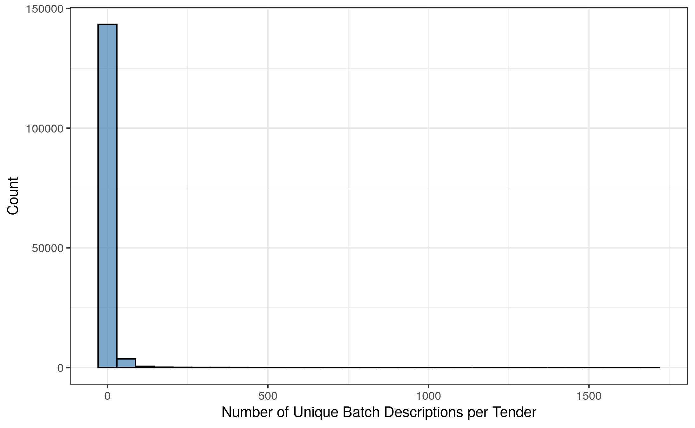
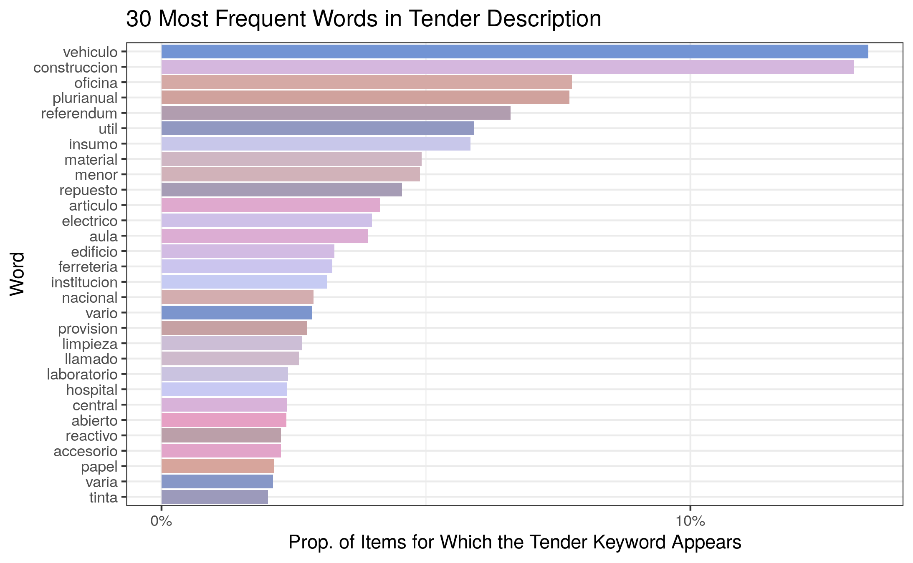

# Context Groupings {#context}

```{r context-setup, include=FALSE}
library(tidytext)
library(tidyverse)
library(tm)

theme_set(theme_bw())

knitr::opts_chunk$set(
  eval = FALSE,
  echo = FALSE,
  comment = NA,
  message = FALSE,
  warning = FALSE
)

setwd("..")
```

```{r context-data-import, include=FALSE}
llamado_file <- "/files/data/llamado.csv"
llamado_grupo_file <- "/files/data/llamado_grupo.csv"
item_solicitado_file <- "/files/data/item_solicitado.csv"

llamado <- llamado_file |>
  read_csv(col_types = cols(.default = "c")) |>
  type_convert()

llamado_grupo <- llamado_grupo_file |>
  read_csv(col_types = cols(.default = "c")) |>
  type_convert()

item_solicitado <- item_solicitado_file |>
  read_csv(col_types = cols(.default = "c")) |>
  type_convert()
```

## Context Information Fields {#context-information-fields}

**QUESTION:** What description granularity is best, keeping in mind that we want to extract the purpose/context of an item within a tender, and not descriptions that are too item-specific?

**OPTIONS:**

- `detalle` (from `llamado`): highest level tender description
- `descripcion` (from `llamado_grupo`): middle level batch description

It seems that most batch descriptions within a tender are identical, and very few tenders have batches with multiple different descriptions. Below is a summary of the number of unique batch descriptions per tender, which shows that the vast majority of tenders have around 1 or 2 different batch descriptions:

```{r context-descriptions-per-tender}
unique_counts <- llamado_grupo |>
  group_by(llamado_id) |>
  summarize(num_unique = n_distinct(descripcion))

summary_per_tender <- unique_counts$num_unique |>
  summary() |>
  as.matrix() |>
  t() |>
  as.data.frame()

saveRDS(summary_per_tender, file = "resources/context/summary-per-tender.rds")

ggplot(unique_counts, aes(x = num_unique)) +
  geom_histogram(color = "black", fill = "steelblue", alpha = 0.7) +
  labs(x = "Number of Unique Batch Descriptions per Tender", y = "Count")

ggsave("resources/context/histogram-per-tender.png")
```

```{r, eval=TRUE}
summary_per_tender <- readRDS("resources/context/summary-per-tender.rds")
knitr::kable(summary_per_tender, booktabs = TRUE)
```



Let's explore the tenders with the highest number of different batch descriptions:

```{r context-top-description-tenders}
top_ids <- unique_counts |>
  arrange(desc(num_unique)) |>
  head(30) |>
  pull(llamado_id)

top_tenders <- llamado |>
  filter(id %in% top_ids) |>
  mutate(detalle = str_to_title(detalle)) |>
  select(detalle)

saveRDS(top_tenders, file = "resources/context/top-tenders.rds")
```

```{r, eval=TRUE}
top_tenders <- readRDS("resources/context/top-tenders.rds")
knitr::kable(top_tenders, booktabs = TRUE, col.names = c("Tender Description"))
```

Tenders that have batches with many different descriptions tend to consist of:

- books / educational materials (case in which the description of each batch might include the book title)
- laboratory substances and/or chemical supplies
- medicine and hospital products
- batteries and spare parts for cars

**CONCLUSION:** It seems best to focus on `detalle` from `llamado` (the highest level tender description).

```{r context-data-wrangling}
digits <- c("dos", "tres", "cuatro", "cinco", "seis", "siete", "ocho", "nueve", "diez")
stopwords <- tibble(word = c(tm::stopwords("spanish"), digits, "nº", "lote", "lotetotal"))
useless_patterns <- "^adq|^serv|^contrat|^mant|^equip|^repara|^prod"

detalle_clean <- item_solicitado |>
  select(id, llamado_grupo_id) |>
  left_join(llamado_grupo, by = c("llamado_grupo_id" = "id")) |>
  select(id, llamado_id) |> 
  left_join(llamado, by = c("llamado_id" = "id")) |>
  # keep track of each item using its id
  select(id, detalle) |>
  # remove all symbols except letters, transform to lowercase, and remove accents
  mutate(detalle = detalle |>
           str_replace_all(pattern = "[^[:alpha:] ]", replacement = " ") |>
           str_to_lower(locale = "es_PY") |>
           iconv(to = "ASCII//TRANSLIT")) |>
  # unnest descriptions into one-row-per-word to remove stopwords
  tidytext::unnest_tokens(output = word, input = detalle) |>
  anti_join(stopwords) |>
  # turn plurals into singulars
  mutate(word = str_replace_all(word, pattern = "es$|s$", replacement = "")) |>
  # remove short words and useless words (e.g., adquisicion, mantenimiento)
  filter(nchar(word) > 3, !str_detect(word, useless_patterns)) |>
  # remove duplicate words from the same description
  distinct() |>
  # regroup words into original descriptions
  group_by(id) |>
  summarize(detalle = paste(word, collapse = " "))
```

## Most Frequent Words {#context-frequent-words}

Below are the 30 most frequent words in the tender descriptions, along with the proportion of items for which that tender keyword appears:

```{r context-frequent-words}
word_freq <- detalle_clean |>
  tidytext::unnest_tokens(output = word, input = detalle) |>
  count(word, sort = TRUE) |> 
  mutate(prop = round(n / nrow(item_solicitado), 4))

word_freq |>
  top_n(30, wt = prop) |>
  ggplot(aes(x = prop, y = reorder(word, prop), fill = word)) +
  geom_bar(stat = "identity") +
  scale_x_continuous(breaks = seq(0, 0.6, by = 0.1),
                     labels = scales::label_percent(accuracy = 1)) +
  scale_fill_manual(values = wesanderson::wes_palette("GrandBudapest2", n = 30,
                                                   type = "continuous")) +
  labs(title = "30 Most Frequent Words in Tender Description",
       x = "Prop. of Items for Which the Tender Keyword Appears", y = "Word") +
  theme(legend.position = "none")

ggsave("resources/context/most-frequent-words.png")
```



The top 100 most frequent words in tender descriptions are listed below:

```{r conntext-top-100-words}
top_100_words <- word_freq |>
  head(100) |>
  pull(word)

saveRDS(top_100_words, file = "resources/context/top-100-words.rds")
```

```{r, eval=TRUE}
top_100_words <- readRDS("resources/context/top-100-words.rds")

cat(top_100_words, sep = ", ", fill = 80)
```

## Most Frequent Word Associations {#context-word-assoc}

It is important to see how associated these words are, in order to help us identify words that commonly occur together in tender descriptions. The table below shows the top 20 most associated word pairs (i.e., the word pairs that most commonly appear together, as measured using the Pearson correlation of the indicator variables):

```{r context-word-correlations}
items <- item_solicitado |>
  left_join(detalle_clean, by = "id") |>
  mutate(lpu = log(precio_unitario)) |>
  filter(!is.infinite(lpu))

# create indicators based on each pattern
top_100_indicator_cols <- map_dfc(top_100_words, function(word) {
  grepl(word, items$detalle)
})

colnames(top_100_indicator_cols) <- top_100_words

combos <- expand_grid(word_1 = top_100_words, word_2 = top_100_words) |>
  filter(word_1 != word_2) |>
  mutate(key = paste0(pmin(word_1, word_2), pmax(word_1, word_2 ), sep = " ")) |>
  distinct(key, .keep_all = TRUE) |>
  select(-key)

results <- map2_dfr(combos$word_1, combos$word_2, function(x, y) {
  data.frame(
    word_1 = x,
    word_2 = y,
    cor = cor(top_100_indicator_cols[[x]], top_100_indicator_cols[[y]], use = "complete")
  )
}) |>
  arrange(desc(cor)) |>
  head(20) |>
  mutate(cor = round(cor, 2))

saveRDS(results, file = "resources/context/word-correlations.rds")
```

```{r, eval=TRUE}
results <- readRDS("resources/context/word-correlations.rds")
knitr::kable(results, booktabs = TRUE, col.names = c("First Word", "Second Word", "Correlation"))
```

## Most Influential Words {#context-word-regression}

Further, we fit a linear regression model based on an indicator associated with each of the top 100 words, to see which ones are most highly associated with our respose (the unitary price). The table below shows the top 20 words with the highest absolute coefficient in the simple linear regression:

```{r context-single-word-regressions}
results_lm <- map_dfr(colnames(top_100_indicator_cols), function(colname) {
  model <- lm(items$lpu ~ top_100_indicator_cols[[colname]])
  data.frame(
    col = colname,
    abs_coeff = abs(summary(model)$coefficients[2])
  )
}) |>
  arrange(desc(abs_coeff)) |>
  head(20) |>
  mutate(abs_coeff = round(abs_coeff, 2))

saveRDS(results_lm, file = "resources/context/influential-words.rds")
```

```{r, eval=TRUE}
results_lm <- readRDS("resources/context/influential-words.rds")
knitr::kable(results_lm, booktabs = TRUE, col.names = c("Word", "Absolute Regression Coefficient"))
```

## Final Context Groupings {#context-groupings}

Based on these tables, we have manually compiled a list of context groupings with their corresponding string patterns:

- Food: `"alimento"` or `"alimenticio"`
- Vehicle: `"vehiculo"`
- Construction: `"construccion"`, `"edificio"`, or `"obra "`
- Hardware: `"ferreteria"` or `"herramienta"`
- Preventive Corrective: `"preventivo"` or `"correctivo"`
- Real Estate: `"inmuebl"`
- Office: `"oficina"`, `"tinta"`, `"toner"`, `"papel"`, `"fotocopiadora"`, `"impreso"`, or `"impresion"`
- Specialized Supplies: `"insumo"`
- Cleaning: `"limpieza"`
- Politics: `"electoral"` or `"justicia"`
- Medical: `"hospital"`, `"medicamento"`, `"medico"`, `"hemato"`, or `"onco"`
- Chemical: `"reactivo"`, `"laboratorio"`, `"quimico"`, or `"quimica"`
- Insurance: `"seguro"`
- Specific Brand: `"marca "`
- Electricity: `"electric"`
- Kitchen: `"cocina"`, `"comedor"`, or `"gastronomic"`
- Computer: `"informatico"` or `"computadora"`
- Air Conditioning: `"aire"` or `"acondicionado"`
- Spare Part: `"respuesto"`
- Machine: `"maquinaria"`
- Fuel: `"combustible"` or `"diesel"`

Around 70\% of items fall under at least one of the above groupings. Fitting a linear regression model using only the indicator variables based on these groupings, we manage to account for almost 19\% of the variability in unitary prices, which is extremely promising:

```{r context-grouping-patterns}
patterns <- c(
  food                  = "alimento|alimenticio",
  vehicle               = "vehiculo",
  construction          = "construccion|edificio|obra ",
  hardware              = "ferreteria|herramienta",
  preventive_corrective = "preventivo|correctivo",
  real_estate           = "inmuebl",
  office                = "oficina|tinta|toner|papel|fotocopiadora|impreso|impresion",
  specialized_supplies  = "insumo",
  cleaning              = "limpieza",
  politics              = "electoral|justicia",
  medical               = "hospital|medicamento|medico|hemato|onco",
  chemical              = "reactivo|laboratorio|quimico|quimica",
  insurance             = "seguro",
  specific_brand        = "marca ",
  electricity           = "electric",
  kitchen               = "cocina|comedor|gastronomic",
  computer              = "informatico|computadora",
  air_conditioning      = "aire|acondicionado",
  spare_part            = "respuesto",
  machine               = "maquinaria",
  fuel                  = "combustible|diesel"
)

items <- item_solicitado |>
  left_join(detalle_clean, by = "id") |>
  mutate(lpu = log(precio_unitario)) |>
  filter(!is.infinite(lpu))

# create indicators based on each pattern
indicator_cols <- map_dfc(patterns, function(word) {
  grepl(word, items$detalle)
})

colnames(indicator_cols) <- patterns

items <- cbind(items, indicator_cols) |>
  select(all_of(patterns), lpu)

mod <- lm(lpu ~ ., data = items)

saveRDS(mod, file = "resources/context/final-model.rds")
```

```{r, eval=TRUE}
mod <- readRDS("resources/context/final-model.rds")

jtools::summ(mod, digits = 4, model.info = FALSE)
```

## Implementation Conclusions {#context-conclusions}

A total of 21 context indicator variables (listed [above](#context-groupings)) were created based on the cleaned-up tender descriptions. Each indicator variable corresponds to certain specific string patterns, and the variable will be *TRUE* for a particular observation if that observation's clean tender description matches those patterns. Otherwise, the indicator variable will be *FALSE*.
