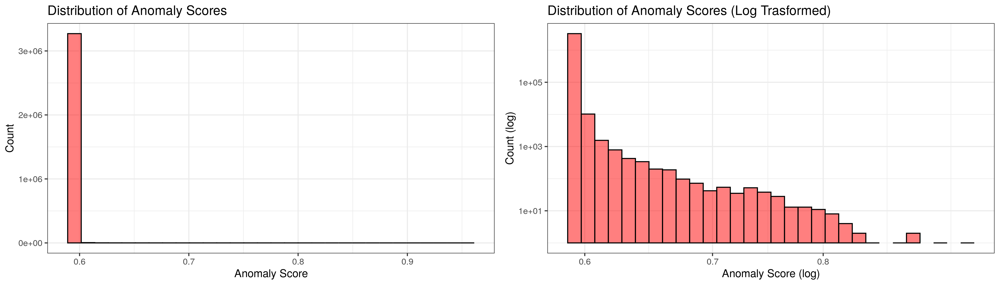

# Outlier Removal {#outlier}

```{r outlier-setup, include=FALSE}
library(lubridate)
library(solitude)
library(tidyverse)

theme_set(theme_bw())

knitr::opts_chunk$set(
  eval = FALSE,
  echo = FALSE,
  comment = NA,
  message = FALSE,
  warning = FALSE
)

setwd("..")
```

```{r outlier-helper-functions, include=FALSE}
# taken from src/functions/fe_helpers.R
prices_to_guarani <- function(dataset, exchange_file) {
  exchange_data <- exchange_file |>
    read_csv() |>
    mutate(year = year(fecha), month = month(fecha), day = day(fecha)) |>
    distinct(year, month, day, .keep_all = TRUE) |>
    select(year, month, day, venta)
  dataset |>
    left_join(exchange_data, by = c("year", "month", "day")) |>
    mutate(precio_unitario = ifelse(
      moneda == "USD",
      precio_unitario * venta,
      precio_unitario
    )) |>
    select(-venta)
}

inflation_adjust_prices <- function(dataset, ipc_file, base_year, base_month) {
  ipc_data <- read_csv(ipc_file)
  base_ipc <- ipc_data |>
    filter(year == base_year, month == base_month) |>
    pull(ipc)
  dataset |> 
    left_join(ipc_data, by = c("year", "month")) |>
    mutate(
      precio_unitario = precio_unitario * (base_ipc / ipc)
    ) |>
    select(-ipc)
}
```

```{r outlier-data-import, include=FALSE}
item_solicitado <- read_csv("/files/data/item_solicitado.csv")
llamado_grupo   <- read_csv("/files/data/llamado_grupo.csv")
llamado         <- read_csv("/files/data/llamado.csv")
pac             <- read_csv("/files/data/pac.csv")

items <- item_solicitado |>
  rename(item_solicitado_id = id, descripcion_item_solicitado = descripcion) |>
  left_join(llamado_grupo, by = c("llamado_grupo_id" = "id")) |>
  rename(descripcion_llamado_grupo = descripcion) |>
  left_join(llamado, by = c("llamado_id" = "id")) |>
  rename(descripcion_llamado = detalle) |>
  left_join(pac, by = c("pac_id" = "id")) |>
  mutate(
    year = year(fecha_ejecucion),
    month = month(fecha_ejecucion),
    day = day(fecha_ejecucion)
  ) |>
  prices_to_guarani(exchange_file = "/files/data/cotizacion.csv") |>
  inflation_adjust_prices(
    ipc_file = "/files/data/ipc.csv",
    base_year = 2021,
    base_month = 6
  ) |>
  select(-c(year, month, day)) |>
  select(
    item_solicitado_id,
    llamado_id,
    precio_unitario,
    descripcion_item_solicitado,
    descripcion_llamado_grupo,
    descripcion_llamado,
    fecha_ejecucion
  ) |>
  mutate(log_precio_unitario = if_else(
    precio_unitario == 0 | is.na(precio_unitario),
    NA_real_,
    log10(precio_unitario)
  )) |>
  drop_na(log_precio_unitario)
```

```{r outlier-isolation-forest, include=FALSE}
items_price <- select(items, precio_unitario)

iso <- isolationForest$new(sample_size = nrow(items_price))

iso$fit(items_price)

predictions <- iso$predict(items_price)

items <- bind_cols(items, select(predictions, anomaly_score))

saveRDS(items, file = "resources/outlier/anomaly-scores.rds")
```

## Anomaly Scores {#outlier-anomaly-scores}

As mentioned in the automated EDA documentation, outlier detection is performed using an isolation forest, which assigns to each observation an anomaly score (from 0 to 1). The plots below display histograms of the anomaly scores, with the left-hand side plot being the origial anomaly scores, while the right-hand side plot shows the log-transformed scores.

```{r outlier-anomaly-score-distribution, warning=FALSE, message=FALSE, fig.height=4, fig.width=14}
p1 <- ggplot(items, aes(x = anomaly_score)) +
  geom_histogram(fill = "red", alpha = 0.5, color = "black") +
  theme_bw() +
  labs(x = "Anomaly Score", y = "Count", title = "Distribution of Anomaly Scores")

p2 <- ggplot(items, aes(x = anomaly_score)) +
  geom_histogram(fill = "red", alpha = 0.5, color = "black") +
  theme_bw() +
  scale_x_log10() +
  scale_y_log10() +
  labs(x = "Anomaly Score (log)", y = "Count (log)",
       title = "Distribution of Anomaly Scores (Log Trasformed)")

cowplot::plot_grid(p1, p2, nrow = 1)

ggsave("resources/outlier/anomaly-scores-histogram.png")
```



Based on the significant skew of the anomaly score distribution (with most observations having a score around 0.58), the cutoff point for outliers was chosen to be 0.6. All observations with anomaly scores greater than 0.6 are considered outliers.

## Outlier Statistics {#outlier-statistics}

```{r outlier-counts, include=FALSE}
outliers <- filter(items, anomaly_score >= 0.6)

# how many items are outliers?
nrow(outliers)
nrow(outliers) / nrow(items) * 100

# how many tenders contain outliers?
nrow(distinct(outliers, llamado_id))
nrow(distinct(outliers, llamado_id)) / nrow(llamado) * 100
```

This cutoff point results in 8672 outliers overall, a mere 0.26\% of the total items. 4647 tenders (or 3.14\% of all tenders) contain at least one item that is a price outlier. These percentages are very low, which is great since we are removing a very small amount of data in exchange for a huge increase in model focus and accuracy.

```{r outlier-price-cutoffs, include=FALSE}
options(scipen = 999)

# minimum price of the outliers
format(min(outliers$precio_unitario), big.mark = ",")
format(min(outliers$precio_unitario) * 0.00015, big.mark = ",")

# maximum price of the outliers
format(max(outliers$precio_unitario), big.mark = ",")
format(max(outliers$precio_unitario) * 0.00015, big.mark = ",")
```

The minimum price of the outliers (or the price cutoff per se) is 185,525,450 Paraguayan guarani (May 2021) or $27,829.

The plot below displays a log-transformed density plot of the unitary prices, with a red dotted line drawn at the aforementioned cutoff of 185 million guarani. All prices within the red shaded area are considered outliers and removed before training the model.

```{r outlier-cutoff-density-plot}
log_min_outlier_price <- min(outliers$log_precio_unitario)

kernel_density <- with(density(items$log_precio_unitario, adjust = 2), data.frame(x, y))

ggplot(kernel_density, aes(x = x, y = y)) +
  geom_line() +
  geom_vline(xintercept = log_min_outlier_price, color = "red1",
             linetype = 2, alpha = 0.4) +
  geom_ribbon(data = filter(kernel_density, x > log_min_outlier_price),
              aes(ymax = y), ymin = 0, fill = "red", color = NA, alpha = 0.5) +
  labs(x = "Unitary Price (log)", y = "Density",
       title = "Visualizing Outliers in Unitary Price")

ggsave("resources/outlier/prices-desity-plot.png")
```


## Outlier Descriptions {#outlier-descriptions}

Finally, it is important to actually take a look at the outliers and see what exactly they entailed. Below are the tender and item descriptions of the top 20 most extreme outliers in terms of price. They include things like fuels (diesel, crude oil), road paving services, hydroelectric power plant construction, and cable-stayed bridge construction. 

```{r outlier-descriptions}
top_outliers <- outliers |>
  arrange(desc(anomaly_score)) |>
  head(20) |>
  select(descripcion_llamado, descripcion_item_solicitado) |>
  mutate(across(everything(), ~str_to_title(.x)))

saveRDS(top_outliers, file = "resources/outlier/top-outliers.rds")
```

<div class="smaller">

```{r, eval=TRUE}
top_outliers <- readRDS("resources/outlier/top-outliers.rds")

knitr::kable(top_outliers, booktabs = TRUE, col.names = c("Tender Description", "Item Description"))
```

</div>

## Implementation Conclusions {#outlier-conclusions}

With the current state of the data, a cutoff value of 0.6 was chosen for the anomaly scores (though this can be changed manually in the feature engineering configuration file). All observations that have anomaly scores of at least 0.6 assigned by the random forest algorithm are considered to be outliers and removed from the training dataset before fitting the model.
