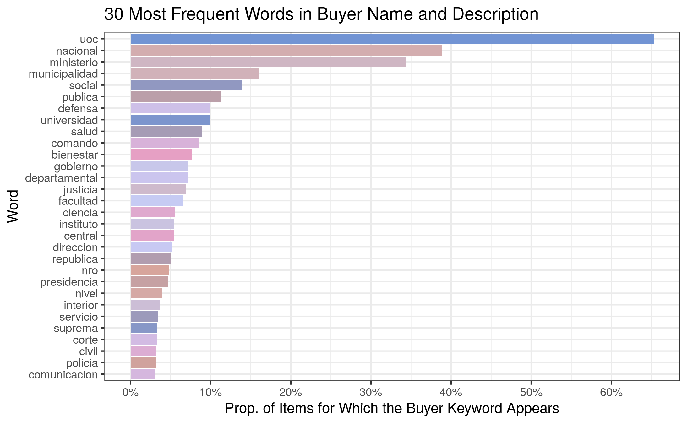

# Buyer Groupings {#buyer}

## Buyer Information Fields {#buyer-information-fields}

Buyers will be considered at the tender level (i.e., one buyer for each row in the `llamado` table). The tables containing buyer/entity information are:

1. `unidad_contratacion`
             
    - left join onto pac by `pac.unidad_contratacion_id = unidad_contratacion.id`
    - **variable of interest:** `descripcion` (description of the buyer; probably easiest to do text mining on, since it includes exact institution names like "hospital" or "university")
    - **additional variables:** `tipo` (UOC, SUOC, or UEP) and `institucion` (whether the buyer is an institution or not)
    
2. `entidad`

    - left join onto `unidad_contratacion` by `unidad_contratacion.entidad_codigo_sicp = entidad.codigo_sicp`
    - **NOTE:** `entidad` has multiple rows  for each value of `entidad.codigo_sicp` (one per year), so the left join must be performed using a reduced version of `entidad` with a single row for each value (see the code snippet below for implementation)
     - **variable of interest:** `nombre` (name of the buyer at a higher level; does not include specific institution names, only broad government and municipality information)

3. `nivel_entidad`

    - left join onto `entidad` by `(entidad.anio, entidad.nivel_entidad_codigo) = (nivel_entidad.anio, nivel_entidad.nivel_entidad_codigo)`
    - **variable of interest:** `nombre` (very broad buyer levels within the public sector)
    
**CONCLUSIONS:** Combine `unidad_contratacion.nombre` and `entidad.nombre` into a single string to perform text mining on. Since `nivel_entidad.nombre` has relatively few categories with little text, it does not lend itself well to text mining. Instead, experiment with it as a categorical variable in its own right.

## Adding Buyer Information to Tenders {#buyer-add-info-to-tenders}

**ISSUE:** The buyer joining process must somehow be incorporated into the feature engineering script, but relational column inconsistencies (in terms of naming and number) and the bidirectional joining order would significantly increase the complexity of the config file.

**IMPLEMENTED SOLUTION:** Perform the buyer joining process in a separate script, which then gets sourced within the feature engineering script if buyer-related variables are listed as predictors in the config file.

## Buyer Levels {#buyer-level}

We fit an OLS regression model for `log_precio_unitario` (our target) against `nivel_entidad` to see how much variability this predictor accounts for by itself.

 <table class="table table-striped table-hover table-condensed table-responsive" style="width: auto !important; margin-left: auto; margin-right: auto;">
<tbody>
  <tr>
   <td style="text-align:left;font-weight: bold;"> F(14,3282352) </td>
   <td style="text-align:right;"> 3566.7951 </td>
  </tr>
  <tr>
   <td style="text-align:left;font-weight: bold;"> R² </td>
   <td style="text-align:right;"> 0.0150 </td>
  </tr>
  <tr>
   <td style="text-align:left;font-weight: bold;"> Adj. R² </td>
   <td style="text-align:right;"> 0.0150 </td>
  </tr>
</tbody>
</table> <table class="table table-striped table-hover table-condensed table-responsive" style="width: auto !important; margin-left: auto; margin-right: auto;border-bottom: 0;">
 <thead>
  <tr>
   <th style="text-align:left;">   </th>
   <th style="text-align:right;"> Est. </th>
   <th style="text-align:right;"> S.E. </th>
   <th style="text-align:right;"> t val. </th>
   <th style="text-align:right;"> p </th>
  </tr>
 </thead>
<tbody>
  <tr>
   <td style="text-align:left;font-weight: bold;"> (Intercept) </td>
   <td style="text-align:right;"> 12.4913 </td>
   <td style="text-align:right;"> 0.0184 </td>
   <td style="text-align:right;"> 678.0445 </td>
   <td style="text-align:right;"> 0.0000 </td>
  </tr>
  <tr>
   <td style="text-align:left;font-weight: bold;"> nivel_entidadcapacitacion dncp </td>
   <td style="text-align:right;"> -4.4322 </td>
   <td style="text-align:right;"> 1.9485 </td>
   <td style="text-align:right;"> -2.2747 </td>
   <td style="text-align:right;"> 0.0229 </td>
  </tr>
  <tr>
   <td style="text-align:left;font-weight: bold;"> nivel_entidadcontraloria general de la republica </td>
   <td style="text-align:right;"> -1.0160 </td>
   <td style="text-align:right;"> 0.0419 </td>
   <td style="text-align:right;"> -24.2320 </td>
   <td style="text-align:right;"> 0.0000 </td>
  </tr>
  <tr>
   <td style="text-align:left;font-weight: bold;"> nivel_entidaddefensoria del pueblo </td>
   <td style="text-align:right;"> -1.5444 </td>
   <td style="text-align:right;"> 0.0648 </td>
   <td style="text-align:right;"> -23.8431 </td>
   <td style="text-align:right;"> 0.0000 </td>
  </tr>
  <tr>
   <td style="text-align:left;font-weight: bold;"> nivel_entidadempresas mixtas </td>
   <td style="text-align:right;"> 0.3968 </td>
   <td style="text-align:right;"> 0.0224 </td>
   <td style="text-align:right;"> 17.6902 </td>
   <td style="text-align:right;"> 0.0000 </td>
  </tr>
  <tr>
   <td style="text-align:left;font-weight: bold;"> nivel_entidadempresas publicas </td>
   <td style="text-align:right;"> -0.3827 </td>
   <td style="text-align:right;"> 0.0193 </td>
   <td style="text-align:right;"> -19.7782 </td>
   <td style="text-align:right;"> 0.0000 </td>
  </tr>
  <tr>
   <td style="text-align:left;font-weight: bold;"> nivel_entidadentes autonomos y autarquicos </td>
   <td style="text-align:right;"> -0.3336 </td>
   <td style="text-align:right;"> 0.0195 </td>
   <td style="text-align:right;"> -17.0953 </td>
   <td style="text-align:right;"> 0.0000 </td>
  </tr>
  <tr>
   <td style="text-align:left;font-weight: bold;"> nivel_entidadentidades financieras oficiales </td>
   <td style="text-align:right;"> -0.3138 </td>
   <td style="text-align:right;"> 0.0212 </td>
   <td style="text-align:right;"> -14.8353 </td>
   <td style="text-align:right;"> 0.0000 </td>
  </tr>
  <tr>
   <td style="text-align:left;font-weight: bold;"> nivel_entidadentidades publicas de seguridad social </td>
   <td style="text-align:right;"> -0.2579 </td>
   <td style="text-align:right;"> 0.0202 </td>
   <td style="text-align:right;"> -12.7640 </td>
   <td style="text-align:right;"> 0.0000 </td>
  </tr>
  <tr>
   <td style="text-align:left;font-weight: bold;"> nivel_entidadgobiernos departamentales </td>
   <td style="text-align:right;"> -0.2731 </td>
   <td style="text-align:right;"> 0.0193 </td>
   <td style="text-align:right;"> -14.1613 </td>
   <td style="text-align:right;"> 0.0000 </td>
  </tr>
  <tr>
   <td style="text-align:left;font-weight: bold;"> nivel_entidadmunicipalidades </td>
   <td style="text-align:right;"> -0.5206 </td>
   <td style="text-align:right;"> 0.0188 </td>
   <td style="text-align:right;"> -27.6727 </td>
   <td style="text-align:right;"> 0.0000 </td>
  </tr>
  <tr>
   <td style="text-align:left;font-weight: bold;"> nivel_entidadpoder ejecutivo </td>
   <td style="text-align:right;"> -0.9751 </td>
   <td style="text-align:right;"> 0.0186 </td>
   <td style="text-align:right;"> -52.4557 </td>
   <td style="text-align:right;"> 0.0000 </td>
  </tr>
  <tr>
   <td style="text-align:left;font-weight: bold;"> nivel_entidadpoder judicial </td>
   <td style="text-align:right;"> -0.4177 </td>
   <td style="text-align:right;"> 0.0192 </td>
   <td style="text-align:right;"> -21.7252 </td>
   <td style="text-align:right;"> 0.0000 </td>
  </tr>
  <tr>
   <td style="text-align:left;font-weight: bold;"> nivel_entidadpoder legislativo </td>
   <td style="text-align:right;"> -0.3389 </td>
   <td style="text-align:right;"> 0.0218 </td>
   <td style="text-align:right;"> -15.5240 </td>
   <td style="text-align:right;"> 0.0000 </td>
  </tr>
  <tr>
   <td style="text-align:left;font-weight: bold;"> nivel_entidaduniversidades nacionales </td>
   <td style="text-align:right;"> -1.1089 </td>
   <td style="text-align:right;"> 0.0190 </td>
   <td style="text-align:right;"> -58.2084 </td>
   <td style="text-align:right;"> 0.0000 </td>
  </tr>
</tbody>
<tfoot><tr><td style="padding: 0; " colspan="100%">
 Standard errors: OLS</td></tr></tfoot>
</table>

By itself, `nivel_entidad` accounts for a statistically significant 1.5\% of the variability in `log_precio_unitario`, so we might consider including it in our model. But what about in conjunction with other predictors?

**ISSUE:** The `nivel_entidad` variable has 15 categories; we must find the best way to merge them.

## Buyer Names and Descriptions {#buyer-name-description}

We join the name and description of a buyer into a single string for each tender and perform text mining.

## Most Frequent Words {#buyer-frequent-words}

Below are the 30 most frequent words in the buyer descriptions, along with the proportion of items for which that buyer keyword appears:

## Final Buyer Groupings {#buyer-groupings}

Since there may be overlap between the keywords present in each buyer name and description, we will be treating the buyer groupings as indicator variables (to which a buyer either belongs or not) -- mutually exclusive categories would not make sense here. Some potential indicator variable groupings are:

- Police: `"policia"`
- Hospital: `"hospital"` or `"cancer"`
- Science: `"ciencia"`
- Health: `"salud"`
- Law: `"justicia"` or `"judicial"`
- Ministry: `"ministerio"`
- Education: `"universidad"`, `"facultad"`, or `"educacion"`
- Army: `"defensa"`, `"comando"`, `"armada"`, or `"ejercito"`
- Bank: `"banco"`
- Tech: `"tecnologia"` or `"aeronautica"`
- Electricity: `"ande"` (administracion nacional de electricidad) or `"electricidad"`

|Grouping    |String Pattern                                 |Proportion |
|:-----------|:----------------------------------------------|:----------|
|police      |policia                                        |3.15%      |
|hospital    |hospital&#124;cancer                           |1.60%      |
|science     |ciencia                                        |5.82%      |
|health      |salud                                          |8.95%      |
|law         |justicia&#124;judicial                         |7.11%      |
|ministry    |ministerio                                     |34.52%     |
|education   |universidad&#124;facultad&#124;educacion       |10.95%     |
|army        |defensa&#124;comando&#124;armada&#124;ejercito |10.01%     |
|bank        |banco                                          |1.94%      |
|tech        |tecnologia&#124;aeronautica                    |3.39%      |
|electricity |ande&#124;electricidad                         |2.49%      |

## Variable Importance Exploration {#buyer-variable-importance}

Finally, we explore the importance of the above groupings when it comes to explaining the variability in `log_precio_unitario`. To find out which indicators might be worth keeping in the baseline regression model, we perform variable selection using the best subsets method. The importance of the different indicators might change once we include other variables, but this is a good first look at what might be most important.

<table>
 <thead>
  <tr>
   <th style="text-align:left;">   </th>
   <th style="text-align:left;"> 10 Vars </th>
   <th style="text-align:left;"> 9 Vars </th>
   <th style="text-align:left;"> 8 Vars </th>
   <th style="text-align:left;"> 7 Vars </th>
   <th style="text-align:left;"> 6 Vars </th>
   <th style="text-align:left;"> 5 Vars </th>
   <th style="text-align:left;"> 4 Vars </th>
   <th style="text-align:left;"> 3 Vars </th>
   <th style="text-align:left;"> 2 Vars </th>
   <th style="text-align:left;"> 1 Vars </th>
  </tr>
 </thead>
<tbody>
  <tr>
   <td style="text-align:left;"> Adjr2 </td>
   <td style="text-align:left;"> 0.0246 </td>
   <td style="text-align:left;"> 0.0246 </td>
   <td style="text-align:left;"> 0.0244 </td>
   <td style="text-align:left;"> 0.0242 </td>
   <td style="text-align:left;"> 0.0236 </td>
   <td style="text-align:left;"> 0.0229 </td>
   <td style="text-align:left;"> 0.0220 </td>
   <td style="text-align:left;"> 0.0199 </td>
   <td style="text-align:left;"> 0.0157 </td>
   <td style="text-align:left;"> 0.0112 </td>
  </tr>
  <tr>
   <td style="text-align:left;"> Cp </td>
   <td style="text-align:left;"> 183.53 </td>
   <td style="text-align:left;"> 366.21 </td>
   <td style="text-align:left;"> 828.40 </td>
   <td style="text-align:left;"> 1574.61 </td>
   <td style="text-align:left;"> 3689.67 </td>
   <td style="text-align:left;"> 5891.46 </td>
   <td style="text-align:left;"> 8936.16 </td>
   <td style="text-align:left;"> 16108.72 </td>
   <td style="text-align:left;"> 30183.28 </td>
   <td style="text-align:left;"> 45445.77 </td>
  </tr>
  <tr>
   <td style="text-align:left;"> Bic </td>
   <td style="text-align:left;"> -81.63k </td>
   <td style="text-align:left;"> -81.46k </td>
   <td style="text-align:left;"> -81.01k </td>
   <td style="text-align:left;"> -80.28k </td>
   <td style="text-align:left;"> -78.18k </td>
   <td style="text-align:left;"> -75.99k </td>
   <td style="text-align:left;"> -72.97k </td>
   <td style="text-align:left;"> -65.84k </td>
   <td style="text-align:left;"> -51.87k </td>
   <td style="text-align:left;"> -36.8k </td>
  </tr>
  <tr>
   <td style="text-align:left;"> Police </td>
   <td style="text-align:left;"> * </td>
   <td style="text-align:left;"> * </td>
   <td style="text-align:left;"> * </td>
   <td style="text-align:left;"> * </td>
   <td style="text-align:left;"> * </td>
   <td style="text-align:left;"> * </td>
   <td style="text-align:left;"> * </td>
   <td style="text-align:left;">  </td>
   <td style="text-align:left;">  </td>
   <td style="text-align:left;">  </td>
  </tr>
  <tr>
   <td style="text-align:left;"> Hospital </td>
   <td style="text-align:left;"> * </td>
   <td style="text-align:left;"> * </td>
   <td style="text-align:left;"> * </td>
   <td style="text-align:left;"> * </td>
   <td style="text-align:left;"> * </td>
   <td style="text-align:left;"> * </td>
   <td style="text-align:left;">  </td>
   <td style="text-align:left;">  </td>
   <td style="text-align:left;">  </td>
   <td style="text-align:left;">  </td>
  </tr>
  <tr>
   <td style="text-align:left;"> Science </td>
   <td style="text-align:left;">  </td>
   <td style="text-align:left;">  </td>
   <td style="text-align:left;">  </td>
   <td style="text-align:left;">  </td>
   <td style="text-align:left;">  </td>
   <td style="text-align:left;">  </td>
   <td style="text-align:left;">  </td>
   <td style="text-align:left;">  </td>
   <td style="text-align:left;">  </td>
   <td style="text-align:left;">  </td>
  </tr>
  <tr>
   <td style="text-align:left;"> Health </td>
   <td style="text-align:left;"> * </td>
   <td style="text-align:left;"> * </td>
   <td style="text-align:left;"> * </td>
   <td style="text-align:left;"> * </td>
   <td style="text-align:left;"> * </td>
   <td style="text-align:left;"> * </td>
   <td style="text-align:left;"> * </td>
   <td style="text-align:left;"> * </td>
   <td style="text-align:left;"> * </td>
   <td style="text-align:left;">  </td>
  </tr>
  <tr>
   <td style="text-align:left;"> Law </td>
   <td style="text-align:left;"> * </td>
   <td style="text-align:left;"> * </td>
   <td style="text-align:left;"> * </td>
   <td style="text-align:left;"> * </td>
   <td style="text-align:left;"> * </td>
   <td style="text-align:left;">  </td>
   <td style="text-align:left;">  </td>
   <td style="text-align:left;">  </td>
   <td style="text-align:left;">  </td>
   <td style="text-align:left;">  </td>
  </tr>
  <tr>
   <td style="text-align:left;"> Ministry </td>
   <td style="text-align:left;"> * </td>
   <td style="text-align:left;"> * </td>
   <td style="text-align:left;">  </td>
   <td style="text-align:left;">  </td>
   <td style="text-align:left;">  </td>
   <td style="text-align:left;">  </td>
   <td style="text-align:left;">  </td>
   <td style="text-align:left;">  </td>
   <td style="text-align:left;">  </td>
   <td style="text-align:left;">  </td>
  </tr>
  <tr>
   <td style="text-align:left;"> Education </td>
   <td style="text-align:left;"> * </td>
   <td style="text-align:left;"> * </td>
   <td style="text-align:left;"> * </td>
   <td style="text-align:left;"> * </td>
   <td style="text-align:left;"> * </td>
   <td style="text-align:left;"> * </td>
   <td style="text-align:left;"> * </td>
   <td style="text-align:left;"> * </td>
   <td style="text-align:left;">  </td>
   <td style="text-align:left;">  </td>
  </tr>
  <tr>
   <td style="text-align:left;"> Army </td>
   <td style="text-align:left;"> * </td>
   <td style="text-align:left;"> * </td>
   <td style="text-align:left;"> * </td>
   <td style="text-align:left;"> * </td>
   <td style="text-align:left;"> * </td>
   <td style="text-align:left;"> * </td>
   <td style="text-align:left;"> * </td>
   <td style="text-align:left;"> * </td>
   <td style="text-align:left;"> * </td>
   <td style="text-align:left;"> * </td>
  </tr>
  <tr>
   <td style="text-align:left;"> Bank </td>
   <td style="text-align:left;"> * </td>
   <td style="text-align:left;">  </td>
   <td style="text-align:left;">  </td>
   <td style="text-align:left;">  </td>
   <td style="text-align:left;">  </td>
   <td style="text-align:left;">  </td>
   <td style="text-align:left;">  </td>
   <td style="text-align:left;">  </td>
   <td style="text-align:left;">  </td>
   <td style="text-align:left;">  </td>
  </tr>
  <tr>
   <td style="text-align:left;"> Tech </td>
   <td style="text-align:left;"> * </td>
   <td style="text-align:left;"> * </td>
   <td style="text-align:left;"> * </td>
   <td style="text-align:left;">  </td>
   <td style="text-align:left;">  </td>
   <td style="text-align:left;">  </td>
   <td style="text-align:left;">  </td>
   <td style="text-align:left;">  </td>
   <td style="text-align:left;">  </td>
   <td style="text-align:left;">  </td>
  </tr>
  <tr>
   <td style="text-align:left;"> Electricity </td>
   <td style="text-align:left;"> * </td>
   <td style="text-align:left;"> * </td>
   <td style="text-align:left;"> * </td>
   <td style="text-align:left;"> * </td>
   <td style="text-align:left;">  </td>
   <td style="text-align:left;">  </td>
   <td style="text-align:left;">  </td>
   <td style="text-align:left;">  </td>
   <td style="text-align:left;">  </td>
   <td style="text-align:left;">  </td>
  </tr>
</tbody>
</table>

## Implementation Conclusions {#buyer-conclusions}

A total of 11 buyer indicator variables (listed [above](#buyer-groupings)) were created based on the cleaned-up and merged buyer descriptions. Each indicator variable corresponds to certain specific string patterns, and the variable will be *TRUE* for a particular observation if that observation's clean buyer description matches those patterns. Otherwise, the indicator variable will be *FALSE*.
