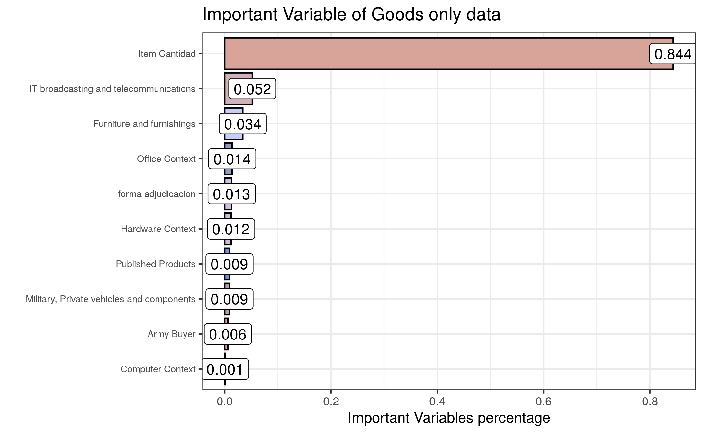
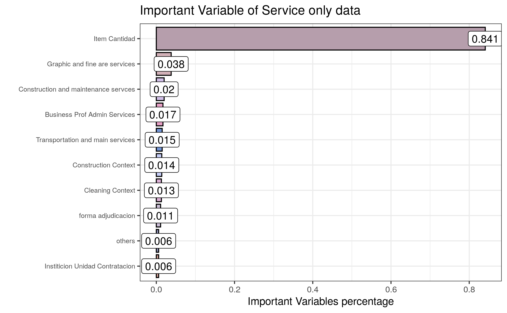
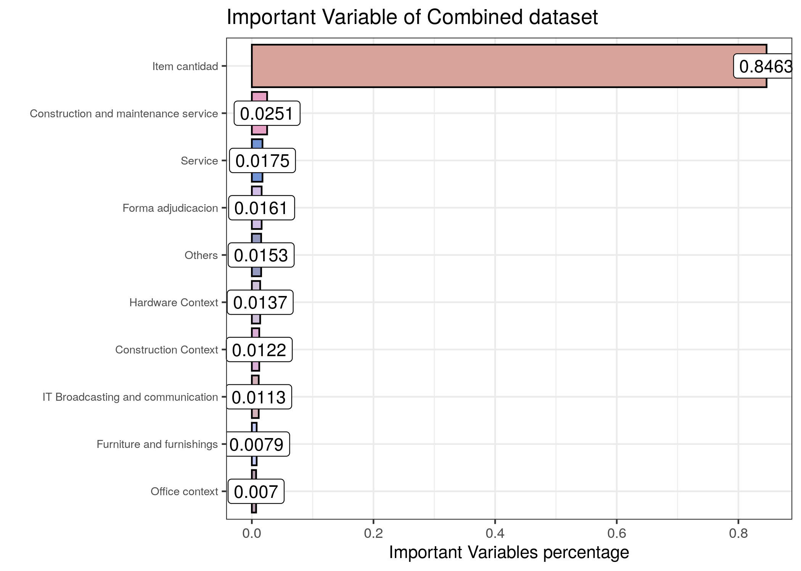

# Model Evaluation {#eval}

## Evaluation Metrics {#eval-metrics}

For this project, several evaluation criteria were used to understand model performances.

### RMSE {#eval-rmse}

The root mean square error (RMSE) was used to understand the general deviance that model predictions had from their actual values. The RMSE gives an estimate of the error in guarani or USD for each item prediction. Typically, the mean is used as the basis for calculating this error; however, this caused outliers to significantly impact the RMSE values, and so the median was used as the center instead in most RMSE calculations for this project.

### Range {#eval-range}

The range of the prediction is the difference between the maximum and minimum value in the predicted values. The range helps to understand the dispersion between models.

### \(R^2\) {#eval-rsq}

R-squared (\(R^2\) is a statistical measure that represents the proportion of the variance of a dependent variable that is explained by the independent variables in a model predicting it. Using this metric, it became clear that more complex models such as XGBoost and random forests performed better with regards to \(R^2\).

### MAE {#eval-mae}

Mean absolute error (MAE) is a measure of errors between paired observations, calculated as the mean of the absolute values of the differences between predicted and actual values by models. It is usually similar in magnitude to RMSE, but slightly smaller, as can be seen from the results of winning model

## Most Important Features {#eval-important-features}

Further evaluation methods were to look at the most important features from each model, as shown through the code below.

## Models Used {#eval-models}

### Linear Regression {#eval-ols}

linear regression was used to have baseline KPIs setup for the model to fit the data, as it is a linear approach to modeling the relationship between a scalar response (or dependent variable) and one or more explanatory variables (or independent variables). In linear regression, the relationships are modeled using linear predictor functions whose unknown model parameters are estimated from the data. 

Linear regression was the first type of regression analysis to be performed rigorously. This is because models which depend linearly on their unknown parameters are easier to fit than models which are non-linearly related to their parameters and because the statistical properties of the resulting estimators are easier to determine.

The quantitative results of the linear regression model can be seen below.

KPI results from the goods dataset:

```
RMSE: 0.89274
MAE: 0.68324
R Squared: 0.35687
Non-Log RMSE: 24489313.70398 PYG (3673.39706 USD) 
Non-Log Median RMSE: 58995.87842 PYG (8.84938 USD)  
```

KPI results from the services dataset:

```
RMSE: 1.05749
MAE: 0.8429
R Squared: 0.17311
Non-Log RMSE: 56371120.49851 PYG (8455.66807 USD) 
Non-Log Median RMSE: 350812.10185 PYG (52.62182 USD) 
```

KPI results from the combined dataset (both goods and services):

```
RMSE: 0.99793
MAE: 0.77541
R Squared: 0.32015
Non-Log RMSE: 64734360.72949 PYG (9710.15411 USD) 
Non-Log Median RMSE: 201014.94886 PYG (30.15224 USD)   
```

### Random Forest {#eval-rf}

Random forest is an ensemble machine learning method in the case of regression, which is mainly implemented by building a great number of decision trees during the training time and
outputting the averaging forest's prediction of the individual trees. The random forest in `mlr3` can be tuned with several tuning parameters: number of trees to grow tree `n`, number of variables at each random split selection `mtry`, and so on. 

The quantitative results of the random forest model can be seen below.

KPI results from the goods dataset:

```
RMSE: 0.53668
MAE:0.39888
R Squared: 0.76758
Non-Log RMSE: 21077688.3875 PYG (3161.65326 USD) 
Non-Log Median RMSE: 29468.16874 PYG (4.42023 USD) 
```

KPI results from the services dataset:

```
RMSE: 0.55089
MAE: 0.41274
R Squared: 0.7756
Non-Log RMSE: 47733933.54249 PYG (7160.09003 USD) 
Non-Log Median RMSE: 188064.15382 PYG (28.20962 USD)
```

### XGBoost {#eval-xgb}

XGBoost is a decision-tree-based ensemble Machine Learning algorithm that uses a gradient boosting framework. when it comes to small-to-medium structured/tabular data, decision tree based algorithms are considered best-in-class right now.

KPI results from the combined dataset (both goods and services) using the XGBoost model:

```
RMSE: 0.48002
MAE:0.3523
R Squared: 0.8427
Non-Log RMSE: 51125287.18182 PYG (7668.79308 USD) 
Non-Log Median RMSE: 55966.30043 PYG (8.39495 USD) 
```

KPI results from the services dataset using the XGBoost model:

```
RMSE: 0.48415
MAE:0.35441
R Squared: 0.82668
Non-Log RMSE: 42147072.80922 PYG (6322.06092 USD) 
Non-Log Median RMSE: 153284.64994 PYG (22.9927 USD) 
```

KPI results from the goods dataset using the XGBoost model:

```
RMSE: 0.47235
MAE:0.34788
R Squared: 0.81996
Non-Log RMSE: 19324456.90415 PYG (2898.66854 USD) 
Non-Log Median RMSE: 24234.82391 PYG (3.63522 USD) 
```

## Top 10 Most Important Features {#eval-top-10}

There are two different standards to compute the influence on the model from different variables. One is computed from permuting the out-of-bag data, and another one is computed from the total decrease in node impurities. Thus, we are able to focus on less but more important variables when there are a great number of variables in the data set.

A benefit of using ensembles methods like gradient boosting and random forests is that they can automatically provide estimates of feature importance from a trained predictive model.

### Goods-Only Dataset {#eval-top-10-goods}



As can be seen from the bar plot above, item `cantidad` plays an important role in predicting the prices, and following variables related to information technology, broadcasting telecommunication, furniture, office context, army buyer, private vehicles, and `forma_adjudicacion` have also an impact in prediction.

### Services-Only Dataset {#eval-top-10-services}



From the bar plot above, item `cantidad` plays an important role in predicting the prices, and following  variables related to fine art and graphic services, building construction and maintenance, administrative and transportation services, `forma_adjudicacion` and `institucion` have also an impact on predictions.

### Combined Dataset {#eval-top-10-combined}



As can be seen from the bar plot above, item `cantidad` plays an important role in predicting the prices, and variables related to building and construction services, hardware context, furniture, office context and construction context are calso onsidered important for prediction.
