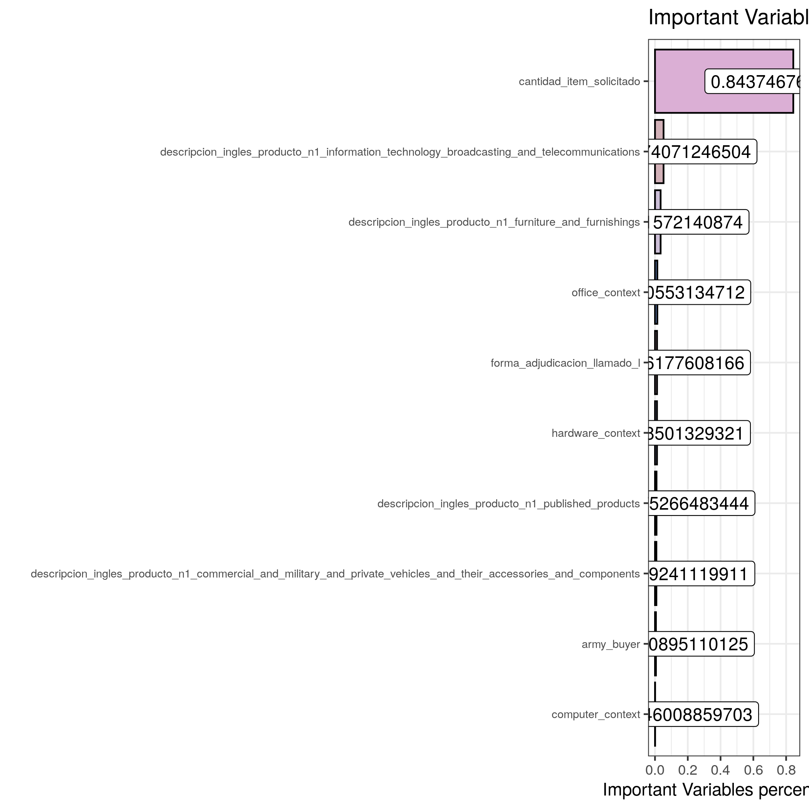
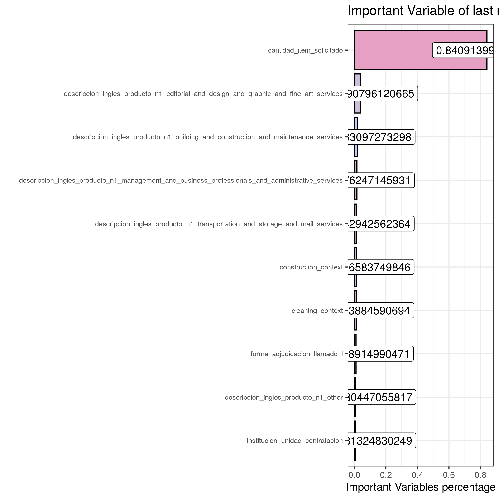
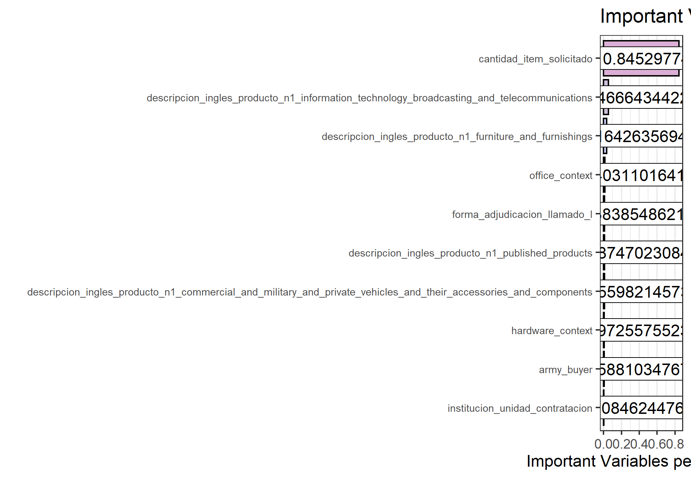

# Evaluation Metric
There are 3 Evaluation criteria or KPI's of the models which have been used according to the dataset.

## RMSE
To removes the skewness of our original data, item prices was transformed for modelling and training and for evaluation the log values was converted back as Mean is affected by outliers. Used Median to evaluate RMSE because even after removing outliers we had larger predicted values

## Range
The range of the prediction is the maximum and minimum value in the predicted values. Even range helps us to understand the dispersion between models.

## R2
R-squared (R2) is a statistical measure that represents the proportion of the variance for a dependent variable that's explained by an independent variables in a regression model and goodness of fit. by moving from linear regression, random forest to xgboost, much more variance was explained by complex ensemble models. 

## MAE
mean absolute error (MAE) is a measure of errors between paired observations expressing the same phenomenon. Examples of Y versus X include comparisons of predicted versus observed. It is usually similar in magnitude to RMSE, but slightly smaller. as can be seen from the results of winning model

# Models Used
## Linear regression

In statistics, linear regression was used to have a baseline KPI's setup for the model to fit the data, as it is a linear approach to modeling the relationship between a scalar response (or dependent variable) and one or more explanatory variables (or independent variables). In linear regression, the relationships are modeled using linear predictor functions whose unknown model parameters are estimated from the data. 

Linear regression was the first type of regression analysis to be performed rigorously. This is because models which depend linearly on their unknown parameters are easier to fit than models which are non-linearly related to their parameters and because the statistical properties of the resulting estimators are easier to determine

The quantitative results of the lm model can be seen below, we can find that the values of RMSE and R2 are

```
RMSE: 0.6702
R Squared: 0.6927
Non-Log RMSE: 28326287.41412 PYG (4360.11208 USD) 
Non-Log Median RMSE: 19966.30043 PYG (9.67495 USD) 

```


## Random forest

Random forest is an ensemble machine learning method in the case of regression, which is mainly implemented by building a great number of decision trees during the training time and
outputting the averaging forest's prediction of the individual trees. The randomForest parameter in the mlr3 package and can be tuned with  several tuning parameters: number of trees to grow tree n , number of variables at each random split selection mtry
and so on. 

Owing to the non-deterministic characteristic of the random forest model. The quantitative results of the RF model can be seen below, we can find that the values of RMSE and R2 are

```
RMSE: 0.58002
MAE:0.4523
R Squared: 0.7427
Non-Log RMSE: 21125287.18182 PYG (3668.79308 USD) 
Non-Log Median RMSE: 19966.30043 PYG (2.39495 USD) 

```


## XGBoost

XGBoost is a decision-tree-based ensemble Machine Learning algorithm that uses a gradient boosting framework. when it comes to small-to-medium structured/tabular data, decision tree based algorithms are considered best-in-class right now.

KPI results from combine dataset(goods and services) using xgboost model

```
RMSE: 0.48002
MAE:0.3523
R Squared: 0.8427
Non-Log RMSE: 51125287.18182 PYG (7668.79308 USD) 
Non-Log Median RMSE: 55966.30043 PYG (8.39495 USD) 

```

KPI results from services only dataset using XGboost model


```
RMSE: 0.48415
MAE:0.35441
R Squared: 0.82668
Non-Log RMSE: 42147072.80922 PYG (6322.06092 USD) 
Non-Log Median RMSE: 153284.64994 PYG (22.9927 USD) 

```
KPI results from goods only dataset using XGboost model

```
RMSE: 0.47235
MAE:0.34788
R Squared: 0.81996
Non-Log RMSE: 19324456.90415 PYG (2898.66854 USD) 
Non-Log Median RMSE: 24234.82391 PYG (3.63522 USD) 

```

# Top 10 Important feature W.R.T. datasets

As one of the specific features, as well as an important application area for  the importance() function which can be used to extract the variable importance scores. There are two different standards to compute the influence on the model from different variables. One is
computed from permuting the out-of-bag data, and another one is computed from the total
decrease in node impurities. Thus, we are able to focus on less but more important variables
when there are a great number of variables in the dataset.

A benefit of using ensembles of decision tree methods like gradient boosting is that they can automatically provide estimates of feature importance from a trained predictive model.


## Goods only model

as can be seen from the bar plot above, cantidad_item_solicitado plays an important role in predicting the prices, following that number of variables related to information technology, broadcasting telecommunication, furniture, office context, army buyer, private vehcles, and forma_adjudicacion.

## Services Only model


as can be seen from the bar plot above, cantidad_item_solicitado plays an important role in predicting the prices, following that number of variables related to fine art and graphic services, building construction and maintenance, administrative and transportation services,  and forma_adjudicacion and institucion_unidad_contraticion

## Combined only model



as can be seen from the bar plot above, cantidad_item_solicitado plays an important role in predicting the prices, following that number of variables related to building and construction services,hardwaare context, furniture, office context and construction context.

# Current training model and the results
The extraction of variable importance and rank them on the basis of importance for the current training_conf.

## Top 10 Important Variables

```{r setup, include=FALSE}
library(moments)
library(readxl)
library(scales)
library(tidyverse)
library(wesanderson)
library(yaml)
library(mlr3verse)

theme_set(theme_bw())

knitr::opts_chunk$set(
  echo = FALSE,
  comment = NA,
  warning = FALSE,
  message = FALSE
)

# ------------------------------------------------------------------------------
# SOURCE HELPER FUNCTIONS
# ------------------------------------------------------------------------------

source("../src/functions/training_helpers.R")

# ------------------------------------------------------------------------------
# DATA IMPORT
# ------------------------------------------------------------------------------

message("Loading datasets and configs...")

conf <- yaml.load_file("../conf/training_conf.yaml")

filename <- paste0('../', conf$data$loc, "training_set_", conf$data$last_run_date, ".rds")
dataset <- readRDS(filename)

message("Done loading datasets and configs.\n")

# ------------------------------------------------------------------------------
# TRAIN/TEST SPLIT
# ------------------------------------------------------------------------------

message("Conducting train/test split...")

id <- conf$features$id
target <- conf$features$target
predictors <- str_subset(colnames(dataset), paste(conf$features$predictors, collapse = ".*|"))

pruned_dataset <- dataset |>
  select(all_of(id), all_of(target), all_of(predictors)) |>
  # order the overall dataset by the target variable
  arrange(all_of(target)) |>
  # drop missing values (assuming they were dealt with in fe.R)
  drop_na()

# create stratified sample using Sturges' Rule
train_indices <- stratified_sample(nrow(pruned_dataset), conf$model$train_prop)

train_set <- pruned_dataset[train_indices, ]
test_set <- pruned_dataset[-train_indices, ]

rm(pruned_dataset, dataset)

message("Done conducting train/test split.\n")

# ------------------------------------------------------------------------------
# MODEL PREPARATION & HYPERPARAMETER TUNING
# ------------------------------------------------------------------------------

message("Setting up the model and tuning hyperparameters...")

task <- as_task_regr(train_set, target = target)

task$set_col_roles(predictors, roles = "feature")

# establish which type of model to fit
learner <- lrn(conf$model$type)

filter = flt("importance", learner = learner)
filter$calculate(task)

```

```{r important feature}
filter_df <- as.data.table(filter) %>% 
  top_n(10)

ggplot(filter_df , aes(y = reorder(feature, score), x = score, fill = feature)) + 
  geom_bar(stat = "identity", color = "black") +
  geom_label(aes(label = score), fill = "white") +
  labs(x = "Important Variables percentage", y = "",
       title = "Important Variable of last run model") +
  scale_fill_manual(values = wes_palette("GrandBudapest2", n = 10, type = "continuous")) +
  scale_y_discrete(labels = rev(filter_df$feature)) +
  theme_bw() +
  theme(legend.position = "none", axis.text.y = element_text(size = 7))

ggsave("combinedkpi.png")

```

## Evaluation Metric 

```{r}

predictions <- readRDS(paste0('../', conf$data$loc,"modelpredictions.rds"))

# print logarithmic RMSE, MAE, and R squared
metrics <- map(conf$model$metrics, \(x) get_metric(predictions, x))

# if the target is log-transformed, print non-logarithmic RMSE as well
if (str_detect(target, "_log$")) {
  obs <- test_set[[target]]
  pred <- predictions$response
  non_log_rmse <- rmse(obs, pred, undo_log = TRUE)
  non_log_median_rmse <- rmse(obs, pred, undo_log = TRUE, median = TRUE)
  pyg_to_usd <- conf$model$pyg_to_usd
  cat(paste0("Non-Log RMSE: ", round(non_log_rmse, 5), " PYG",
             " (", round(pyg_to_usd * non_log_rmse, 5), " USD) ", "\n"))
  cat(paste0("Non-Log Median RMSE: ", round(non_log_median_rmse, 5), " PYG",
             " (", round(pyg_to_usd * non_log_median_rmse, 5), " USD) ", "\n"))
}


```


## Visualization 
Across the last few subsections, three typical models (Ordinary Linear Regression, Random Forest and XGBoost) have been implemented to the given(goods only, service only, and combined) dataset, and the quantitative and visual performance of the built models are analyzed in details.

At first, the simplest ordinary linear regression model is built using mlr3 package Although
the OLR model can be easily interpreted, the regression diagnostics are still conducted to explain the poorly predictive ability of the linear regression model.

In the next step, the Random forest and XGBoost is applied using the mlr3 package, The performance of the model fit is explicitly improved as can be seen from scatter plots of Actual vs Predicted are one of the richest form of data visualization. Ideally, all points are close to a regressed diagonal line.

```{r Graphs}


autoplot(predictions) +
  labs(title = "Actual vs. Predicted, Unit Item Price Model")

```

The Histogram of the Residual can be used to check whether the variance is normally distributed.

```{r histogram Graphs}

autoplot(predictions, type = "histogram") +
  labs(title = "Histogram of Residuals, Unit Item Price Model")

```

If the points in a residual plot are randomly dispersed around the horizontal axis, The plot is used to detect non-linearity, unequal error variances, and outliers if any.
and all the other points are also mainly located around the diagonal line. The bottom plot is of predicted values vs. residual values, where all the points are almost randomly distributed around the horizontal line, except for the bottom-left corner due to the over-prediction for the small values.

```{r residual Graphs}

autoplot(predictions, type = "residual") +
  labs(title = "Residuals vs. Predicted, Unit Item Price Model")


```


# Conclusion

The study shows a comparison between the regression algorithms like linear regression, random forest and xgboost when predicting item prices for DNCP, Paraguay. The results were promising for the tender data due to it being rich with features extracted using clustering of description and having strong correlation. However, XGBoost gave the best RMSE and R2 score, and Lasso linear regression got the worst KPI's overall. The final results of this study showed that XGboost with hyperparameter tuning makes better prediction compared to other used algorithms.


item quantity, information technology, broadcasting telecommunication, furniture, office context, army buyer have a high positive influence on item prices.


The results answer the research questions as follows:
- Question 1 ? Which machine learning algorithm performs better and has the most
accurate result in item price prediction? And why?

XGBoost made the best performance overall when both R2 and RMSE scores are taking into consideration. It has achieved the best performance due to its hyperparameter tuning and ensemble technique

# Limitation

Despite the matter that research strategy and data cleaning process were thoughtfully considered in advance to conducting primary research/analysis, restraints for this research have been encountered like lack of computational power to run complex machine learning models,
harder to model service prices model due to much more variability in prices if compared to only goods

# Next Steps

Next some future work and improvements are listed which will improve the usage of the results
for business use. The first improvement is to use predicted item prices to identify corruption amongst many public sectors in paraguay, secondly is to identify confidence intervals of item predicted prices  


